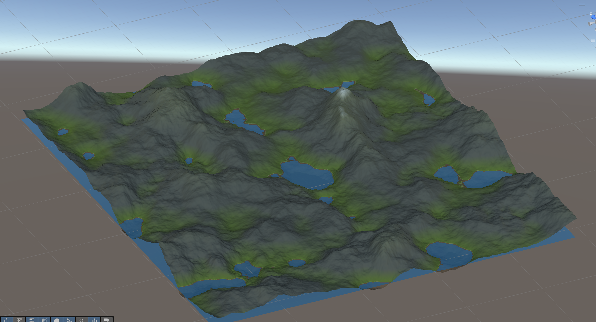
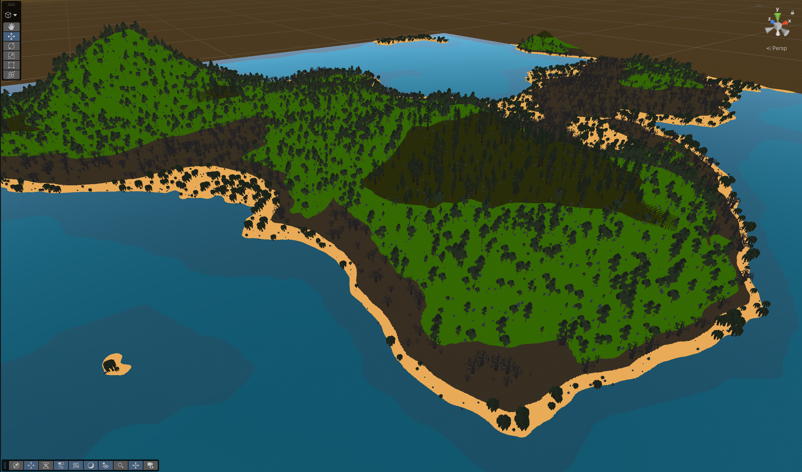
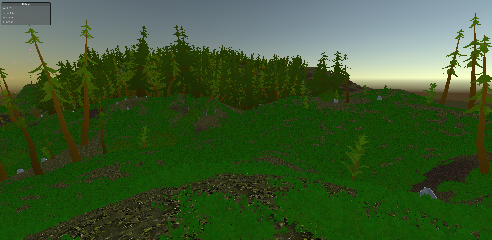
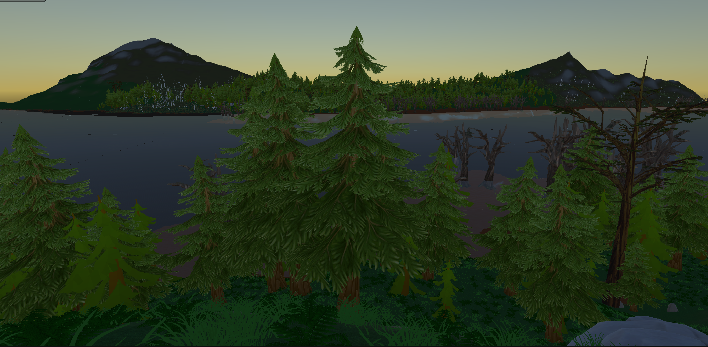
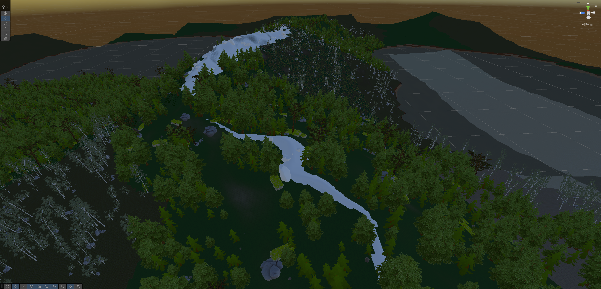
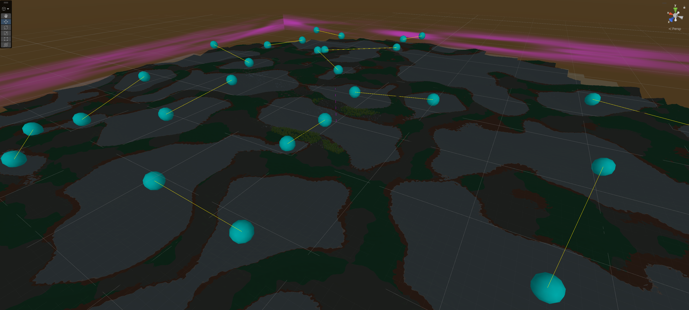
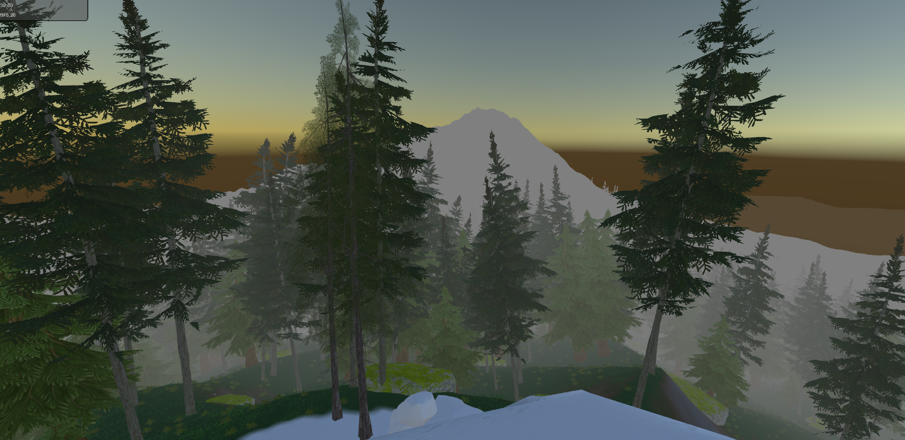

This repo does not include any prefabs anf textures. Please, use your own.

Upcoming: cliffs, rivers.

# Timeline:

## Basic terrain

## Basic biomes

## Adding grass, rocks, trees

## Added water plus some noise modifiers

## Connecting lakes

## Just a nice view

## List of features:
### 1. Procedural Heightmap Generation (Layered Noise System)
At the core: multi-layer noise synthesis, able of combining:
- Perlin noise
- Voronoi noise
- Mask layers
- Multiple configurable noise layers

Which gives:
- Macro terrain (continents, valleys, mountain chains)
- Micro detail (surface variation)
- Adjustable frequency, amplitude, and blending per layer

### 2. Structural Height Modifiers
Structural shaping — cracks, ridges, large-scale features. Terrain supports:
- Directed cracks or fault lines
- Crossed fracture patterns
- Deterministic structural shapes
- Height modification before multiplier scaling

### 3. Biome System with Density Map
Generates a biome density map that stores:
- Primary biome
- Secondary biome
- Blend weights

That enables:
- Multi-biome transitions
- Smooth blending based on biome weights
- Biome-aware height shaping
- Different terrain logic per biome

### 4. Deterministic Chunk-Based Generation
The world:
- Is chunk-based
- Is deterministic
- Supports on-the-fly generation
- Uses coordinate-based sampling

That means:
- Infinite world potential
- Stable regeneration
- No floating trees and rocks from coordinate errors
- Deterministic rivers possible

### 5. Object & Vegetation Spawning System
Implemented:
- Chunk-based spawn queues
- Spawn rate limiting per frame
- Thousands of objects
- Tens of thousands of grass instances
- Stable 200 FPS, boots in 6-7 seconds (100x100 chunks)
- Lazy loading
- No leaks

### 6. Biome-Aware Object Placement
System supports:
- Biome-based spawning rules
- Density control
- Chunk ownership tracking
- Controlled despawning

## Known bugs:
- A couple of micro freezes when loading a new terrain chunk